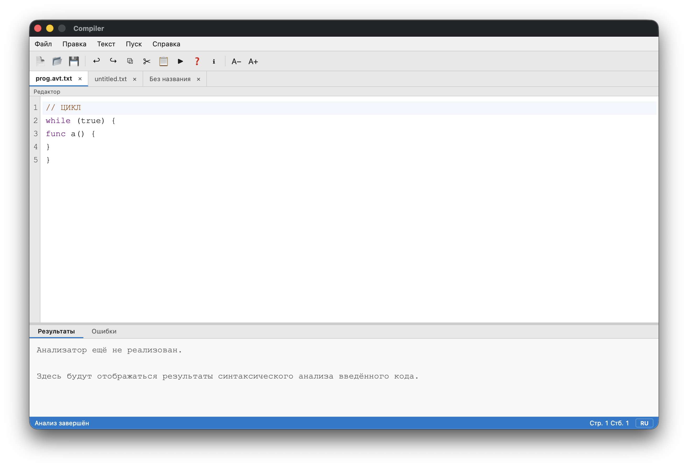
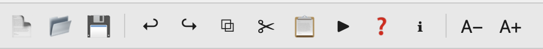
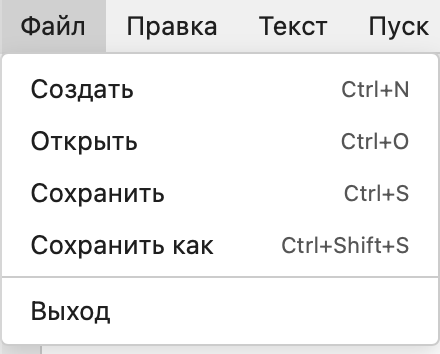
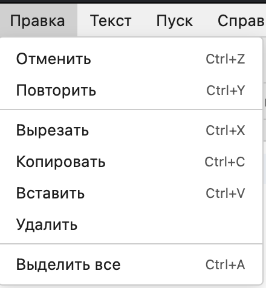

# Разработка пользовательского интерфейса (GUI) для языкового процессора

**Студент:** Ненашкин Владимир Денисович  
**Группа:** АВТ-313  
**Университет:** НГТУ, АВТФ  

---

## О проекте

Графическая оболочка языкового процессора на Go + React. Приложение представляет собой многовкладочный текстовый редактор на базе CodeMirror с возможностью запуска синтаксического анализатора: сверху располагается область ввода кода, снизу — панель вывода результатов и таблица ошибок. Интерфейс поддерживает стандартные операции с файлами, редактирование текста, масштабирование шрифта, drag-and-drop файлов и навигацию через меню, панель инструментов и горячие клавиши. Поддерживается два языка интерфейса — русский и английский.

---

## Технологии

| Что | Чем |
|---|---|
| Язык (бэкенд) | Go 1.23 |
| GUI-фреймворк | [Wails](https://wails.io/) v2.11.0 |
| Фронтенд | React 18 + TypeScript |
| Редактор кода | [CodeMirror](https://codemirror.net/) 6 |
| Сборщик фронтенда | Vite |
| Среда разработки | GoLand |

---

## Сборка и запуск

### Зависимости

- Go 1.23+
- Node.js 18+
- [Wails CLI](https://wails.io/docs/gettingstarted/installation): `go install github.com/wailsapp/wails/v2/cmd/wails@latest`

### Режим разработки (hot-reload)

```bash
wails dev
```

Откроет приложение с автоматической перезагрузкой при изменениях в фронтенде.

### Сборка релизного бинарника

```bash
wails build
```

Готовый исполняемый файл появится в `build/bin/`.

### Готовые бинарники

Публикуются на странице [Releases](https://github.com/SuLG-ik/compiler-go/releases/latest) в GitHub. Также можно найти сборку по конкретному тегу:

```
https://github.com/SuLG-ik/compiler-go/releases/tag/<версия>
```

---

## Интерфейс и функции

Окно приложения состоит из пяти зон: строка меню, панель инструментов, панель вкладок, рабочая область (редактор + вывод) и строка состояния.



### Панель инструментов

Расположена под строкой меню. Содержит кнопки для самых частых действий: создать, открыть, сохранить, отменить, повторить, копировать, вырезать, вставить, запустить анализатор, справку, «О программе», уменьшить/увеличить шрифт.



### Панель вкладок

Под панелью инструментов. Поддерживает несколько одновременно открытых файлов; активная вкладка выделена, несохранённые изменения обозначаются символом `*`. Вкладку можно закрыть кнопкой `×`.

### Меню «Файл»



- **Создать** (`Ctrl+N`) — открывает новую пустую вкладку; при несохранённых изменениях предлагает сохранить
- **Открыть** (`Ctrl+O`) — диалог выбора файла (`.txt`, `.go`, `.c`, `.cpp`, `.h`, `.pas`, `.cs`, `.py` и все остальные); поддерживается drag-and-drop файла на окно
- **Сохранить** (`Ctrl+S`) — сохраняет текущий файл; если файл новый, работает как «Сохранить как»
- **Сохранить как** (`Ctrl+Shift+S`) — сохраняет в новый файл
- **Выход** — закрывает приложение

### Меню «Правка»



- **Отменить / Повторить** (`Ctrl+Z` / `Ctrl+Y`)
- **Вырезать / Копировать / Вставить / Удалить** (`Ctrl+X` / `Ctrl+C` / `Ctrl+V`)
- **Выделить всё** (`Ctrl+A`)

### Меню «Пуск»

- **Пуск** (`Ctrl+R`) — запускает синтаксический анализатор. Введённый текст передаётся на обработку, результат выводится на вкладке «Результаты», ошибки — на вкладке «Ошибки» (таблица с номером, строкой, столбцом и описанием).

### Меню «Справка»

- **Вызов справки** (`F1`) — модальное окно с таблицей горячих клавиш
- **О программе** — версия приложения и сведения об авторе

### Рабочая область

Делится на две части горизонтальным разделителем, который можно перетаскивать мышью:

- **Редактор (сверху)** — CodeMirror 6; поддерживает подсветку синтаксиса, отмену/повтор и стандартные операции редактирования. Размер шрифта регулируется через `Ctrl+=` / `Ctrl+-` (диапазон 10–24 pt).
- **Вывод (снизу)** — область «только чтение» с двумя вкладками:
  - **Результаты** — текстовый вывод языкового процессора
  - **Ошибки** — таблица ошибок (№, строка, столбец, описание)

### Строка состояния

Расположена внизу окна. Отображает текущий статус, позицию курсора (строка / столбец) и переключатель языка интерфейса (Русский / English).

---

## Ограничения

- Логика синтаксического анализатора пока не реализована (заглушка). Разделы меню «Текст» содержат шаблонный текст. Всё это будет добавлено в следующих лабораторных работах.
