# Лабораторная работа 7

## Анализ и преобразование кода с использованием Clang и LLVM

Студент: Ненашкин Владимир Денисович  
Группа: АВТ-313  
Индивидуальный вариант: 2.10  
Тема индивидуального задания: Функции (объявление / создание)

## Цель работы

Изучить инструменты Clang и LLVM, получить абстрактное синтаксическое дерево и промежуточное представление программы, применить оптимизации, построить граф потока управления и проанализировать результат для обычной функции и для inline-функции.

## Ход работы

### 1. Подготовка среды

Работа выполнялась в Ubuntu 26.04 внутри Docker-контейнера. Сначала из каталога lab7 был запущен контейнер:

```bash
docker run --name lab7-ubuntu -it -v "$PWD":/work -w /work ubuntu:26.04 bash
```

После входа в контейнер были установлены необходимые пакеты:

```bash
apt-get update
apt-get install -y clang llvm graphviz
clang --version
opt --version
dot -V
```

Для сохранения результатов были созданы рабочие каталоги:

```bash
cd /work
mkdir -p artifacts/ast artifacts/ir artifacts/diff \
  artifacts/cfg/general_O0 artifacts/cfg/general_O2 \
  artifacts/cfg/variant_O0 artifacts/cfg/variant_O2 artifacts/cfg/variant_always_inline \
  images/generated
```

Скриншот среды и установленных инструментов: 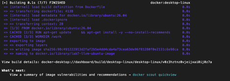

### 2. Основное задание

В качестве исходной программы был использован файл src/general.c:

```c
#include <stdio.h>

int square(int x) {
    return x * x;
}

int main(void) {
    int a = 5;
    int b = square(a);
    printf("%d\n", b);
    return 0;
}
```

#### 2.1 Получение AST

Для построения абстрактного синтаксического дерева была выполнена команда:

```bash
clang -Xclang -ast-dump -fsyntax-only src/general.c > artifacts/ast/general_ast.txt
grep -nE "FunctionDecl.*(square|main)|BinaryOperator.*'\\*'|CallExpr" artifacts/ast/general_ast.txt
```

Фрагмент полученного вывода:

```text
1086:|-FunctionDecl ... used square 'int (int)'
1090:|     `-BinaryOperator ... 'int' '*'
1095:`-FunctionDecl ... main 'int (void)'
1102:    |   `-CallExpr ... 'int'
1107:    |-CallExpr ... 'int'
```

По AST видно, что компилятор выделил две функции, операцию умножения в square и вызовы функций внутри main.

Скриншот AST: 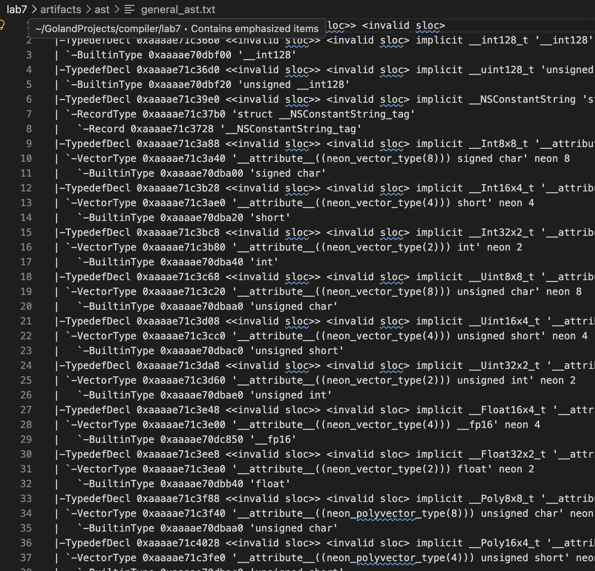

#### 2.2 Получение LLVM IR

Для генерации LLVM IR при разных уровнях оптимизации были выполнены команды:

```bash
clang -O0 -S -emit-llvm src/general.c -o artifacts/ir/general_O0.ll
clang -O2 -S -emit-llvm src/general.c -o artifacts/ir/general_O2.ll
clang -O0 -Xclang -disable-O0-optnone -S -emit-llvm src/general.c -o artifacts/ir/general_O0_no_optnone.ll
opt -S "-passes=default<O2>" artifacts/ir/general_O0_no_optnone.ll -o artifacts/ir/general_opt_O2_via_opt.ll
```

Далее был выполнен просмотр различий между версиями IR для -O0 и -O2:

```bash
diff -u artifacts/ir/general_O0.ll artifacts/ir/general_O2.ll > artifacts/diff/general_O0_vs_O2.diff
```

Фрагмент различий:

```text
--- artifacts/ir/general_O0.ll
+++ artifacts/ir/general_O2.ll
@@
-define dso_local i32 @square(i32 noundef %0) #0 {
-  %2 = alloca i32, align 4
-  store i32 %0, ptr %2, align 4
-  %3 = load i32, ptr %2, align 4
-  %4 = load i32, ptr %2, align 4
-  %5 = mul nsw i32 %3, %4
-  ret i32 %5
+define dso_local i32 @square(i32 noundef %0) local_unnamed_addr #0 {
+  %2 = mul nsw i32 %0, %0
+  ret i32 %2
 }
@@
-define dso_local i32 @main() #0 {
-  %1 = alloca i32, align 4
-  %2 = alloca i32, align 4
-  %3 = alloca i32, align 4
-  %4 = load i32, ptr %2, align 4
-  %5 = call i32 @square(i32 noundef %4)
-  %7 = call i32 (ptr, ...) @printf(ptr noundef @.str, i32 noundef %6)
+define dso_local noundef i32 @main() local_unnamed_addr #1 {
+  %1 = tail call i32 (ptr, ...) @printf(ptr noundef nonnull dereferenceable(1) @.str, i32 noundef 25)
+  ret i32 0
 }
```

После оптимизации из IR исчезают лишние обращения к памяти, а выражение square(5) сворачивается в константу 25.

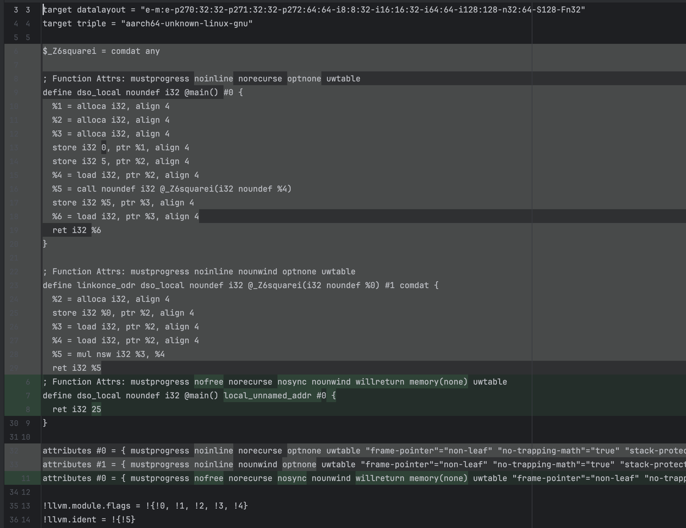

#### 2.3 Построение CFG

Графы потока управления были построены отдельно для варианта -O0 и -O2.

Для версии -O0 были выполнены команды:

```bash
cd artifacts/cfg/general_O0
opt -passes=dot-cfg -disable-output ../../ir/general_O0.ll
dot -Tpng .main.dot -o cfg_main.png
dot -Tpng .square.dot -o cfg_square.png
cd /work
```

Для версии -O2 были выполнены команды:

```bash
cd artifacts/cfg/general_O2
opt -passes=dot-cfg -disable-output ../../ir/general_O2.ll
dot -Tpng .main.dot -o cfg_main.png
dot -Tpng .square.dot -o cfg_square.png
cd /work
```


Файлы с графами:

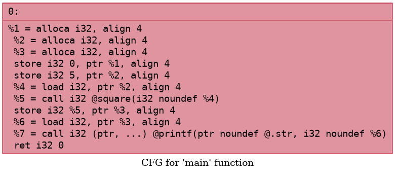
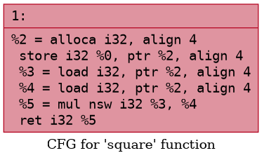
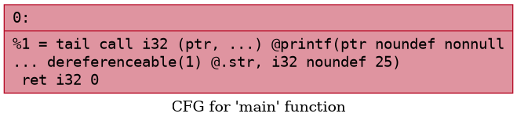


По CFG видно, что после оптимизации структура функции main становится проще, а часть вычислений переносится на этап компиляции.

### 3. Индивидуальное задание

Для индивидуального задания был использован файл src/variant_functions.cpp:

```cpp
inline int square(int x) {
    return x * x;
}

int main() {
    int a = 5;
    int b = square(a);
    return b;
}
```


#### 3.1 Получение IR при -O0

Были выполнены команды:

```bash
clang++ -std=c++17 -O0 -S -emit-llvm src/variant_functions.cpp -o artifacts/ir/variant_O0.ll
```

Фрагмент IR:

```text
$_Z6squarei = comdat any

define dso_local noundef i32 @main() #0 {
    %1 = alloca i32, align 4
    %2 = alloca i32, align 4
    %3 = alloca i32, align 4
    store i32 0, ptr %1, align 4
    store i32 5, ptr %2, align 4
    %4 = load i32, ptr %2, align 4
    %5 = call noundef i32 @_Z6squarei(i32 noundef %4)
    store i32 %5, ptr %3, align 4
    %6 = load i32, ptr %3, align 4
    ret i32 %6
}

define linkonce_odr dso_local noundef i32 @_Z6squarei(i32 noundef %0) #1 comdat {
    %2 = alloca i32, align 4
    store i32 %0, ptr %2, align 4
    %3 = load i32, ptr %2, align 4
    %4 = load i32, ptr %2, align 4
    %5 = mul nsw i32 %3, %4
    ret i32 %5
}
```

При -O0 inline-функция ещё не встроена: в IR она присутствует как отдельная функция, а из main выполняется вызов _Z6squarei.


#### 3.2 Получение IR при -O2

Были выполнены команды:

```bash
clang++ -std=c++17 -O2 -S -emit-llvm src/variant_functions.cpp -o artifacts/ir/variant_O2.ll
cat artifacts/ir/variant_O2.ll
```

Полученный IR:

```text
define dso_local noundef i32 @main() local_unnamed_addr #0 {
    ret i32 25
}
```

При -O2 функция square встроилась в main. После этого компилятор выполнил свёртку констант и упростил тело main до одной команды ret i32 25.

Скриншот LLVM IR для inline-функции: 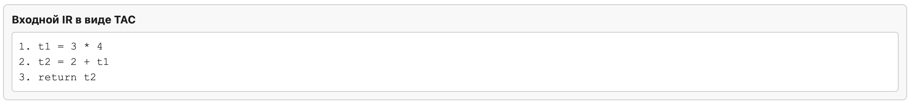

#### 3.3 Применение always_inline

Для проверки принудительного встраивания использовался файл src/variant_always_inline.cpp:

```cpp
__attribute__((always_inline)) inline int square(int x) {
    return x * x;
}

int main() {
    int a = 5;
    int b = square(a);
    return b;
}
```

Сначала был получен IR без стандартного opnone для -O0:

```bash
clang++ -std=c++17 -O0 -Xclang -disable-O0-optnone -S -emit-llvm src/variant_always_inline.cpp -o artifacts/ir/variant_always_inline_O0_no_optnone.ll
```

Фрагмент IR:

```text
define dso_local noundef i32 @main() #0 {
    %1 = alloca i32, align 4
    %2 = alloca i32, align 4
    %3 = alloca i32, align 4
    %4 = alloca i32, align 4
    store i32 0, ptr %2, align 4
    store i32 5, ptr %3, align 4
    %5 = load i32, ptr %3, align 4
    store i32 %5, ptr %1, align 4
    %6 = load i32, ptr %1, align 4
    %7 = load i32, ptr %1, align 4
    %8 = mul nsw i32 %6, %7
    store i32 %8, ptr %4, align 4
    %9 = load i32, ptr %4, align 4
    ret i32 %9
}
```

Видно, что отдельного вызова функции уже нет: тело square встроено в main ещё до дополнительных проходов opt.

Затем был применён проход always-inline:

```bash
opt -S -passes=always-inline artifacts/ir/variant_always_inline_O0_no_optnone.ll -o artifacts/ir/variant_after_always_inline.ll
cat artifacts/ir/variant_after_always_inline.ll
```

После этого структура программы заметно не изменилась, потому что встраивание произошло ещё на предыдущем шаге.

Скриншот результата always_inline: 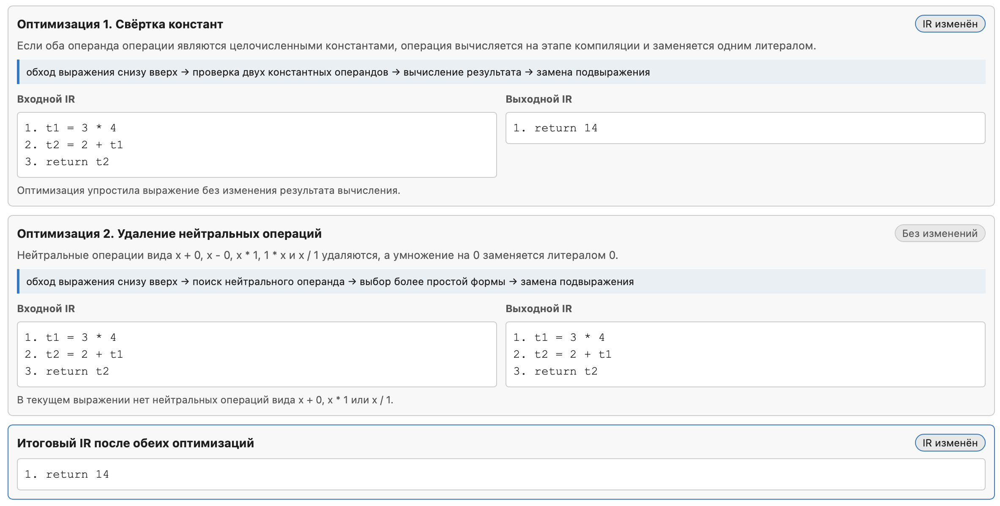

Далее был запущен полный пайплайн оптимизаций O2:

```bash
opt -S "-passes=default<O2>" artifacts/ir/variant_always_inline_O0_no_optnone.ll -o artifacts/ir/variant_after_opt_O2.ll
cat artifacts/ir/variant_after_opt_O2.ll
```

Результат:

```text
define dso_local noundef i32 @main() local_unnamed_addr #0 {
    ret i32 25
}
```

После полного набора оптимизаций убираются лишние операции загрузки и сохранения, а вычисление окончательно сворачивается в константу.

#### 3.4 Построение CFG для индивидуального задания

Для варианта -O0 были выполнены команды:

```bash
cd artifacts/cfg/variant_O0
opt -passes=dot-cfg -disable-output ../../ir/variant_O0.ll
dot -Tpng .main.dot -o cfg_main.png
dot -Tpng ._Z6squarei.dot -o cfg__Z6squarei.png
cd /work
```

Для варианта -O2 были выполнены команды:

```bash
cd artifacts/cfg/variant_O2
opt -passes=dot-cfg -disable-output ../../ir/variant_O2.ll
dot -Tpng .main.dot -o cfg_main.png
cd /work
```

Для варианта с always_inline были выполнены команды:

```bash
cd artifacts/cfg/variant_always_inline
opt -passes=dot-cfg -disable-output ../../ir/variant_after_always_inline.ll
dot -Tpng .main.dot -o cfg_main.png
cd /work
```

Файлы с графами:

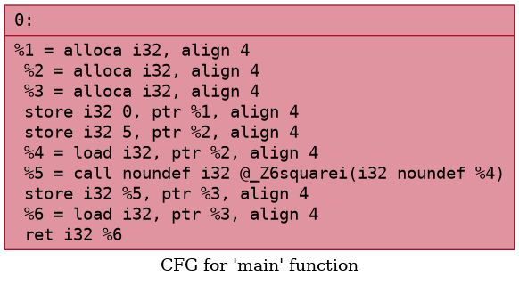
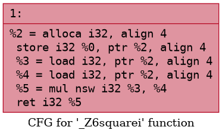
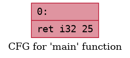
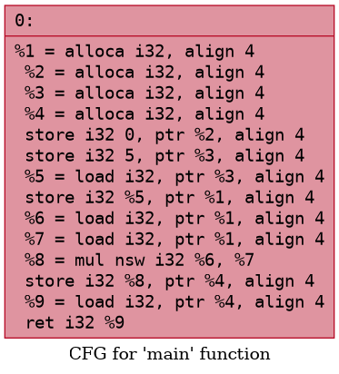

#### 3.5 Вывод по индивидуальному заданию

При -O0 ключевое слово inline само по себе не приводит к немедленному встраиванию функции в LLVM IR. Функция square остаётся отдельной единицей, и main вызывает её как обычную функцию.

При -O2 функция square встраивается, после чего LLVM выполняет распространение констант и упрощает вычисление до ret i32 25.

При использовании атрибута always_inline встраивание происходит раньше. Однако окончательное упрощение программы достигается только после полного набора оптимизаций, когда из IR убираются лишние обращения к памяти.

Следовательно, встраивание функции в LLVM зависит от доступности тела функции, её простоты, уровня оптимизации и наличия явных атрибутов, таких как always_inline.

## Общий вывод

В ходе работы были изучены базовые возможности Clang и LLVM. Для программы на C было получено AST, построено LLVM IR и показано, как оптимизация O2 упрощает код и переносит часть вычислений на этап компиляции. Для индивидуального задания было установлено, что inline-функция при -O0 может сохраняться как отдельная функция, а при -O2 встраивается в вызывающий код. Атрибут always_inline заставляет выполнить встраивание раньше, но наилучший результат достигается только вместе с остальными оптимизациями.

## Ответы на контрольные вопросы

1. Clang — это фронтенд компилятора для языков C, C++ и Objective-C. Он разбирает исходный код, строит AST и формирует LLVM IR.

2. LLVM — это набор библиотек и инструментов для оптимизации промежуточного представления и генерации машинного кода под разные платформы.

3. AST описывает синтаксическую структуру программы на уровне исходного языка, а LLVM IR представляет программу в виде низкоуровневых инструкций, удобных для анализа и оптимизации.

4. Промежуточное представление нужно для того, чтобы отделить разбор исходного языка от оптимизаций и генерации машинного кода.

5. Инструкция alloca выделяет память на стеке под локальную переменную или временное значение.

6. Оптимизация нужна для ускорения программы, уменьшения её размера и устранения лишних вычислений.

7. SSA-форма — это представление, в котором каждое значение присваивается только один раз. Это упрощает анализ зависимостей и применение оптимизаций.

8. CFG — это граф потока управления, показывающий базовые блоки и переходы между ними. Он нужен для анализа порядка выполнения программы.

9. Арифметические операции в LLVM IR задаются отдельными инструкциями, например add, sub, mul, fadd, fmul.

10. Функции в LLVM IR удобно рассматривать отдельно, потому что для них можно независимо выполнять анализ, оптимизацию, встраивание и удаление неиспользуемого кода.

11. Если функция короткая и вызывается в удобном для оптимизатора месте, компилятор может встроить её в вызывающий код.

12. IR и CFG удобнее для автоматических оптимизаций, чем исходный текст на C, потому что они имеют точную и однозначную структуру и не содержат лишних синтаксических деталей исходного языка.
