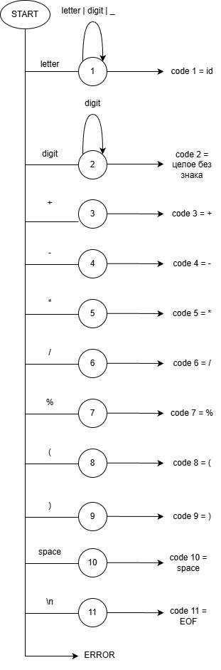
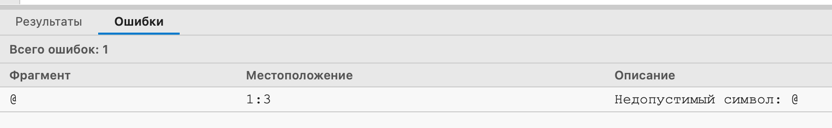
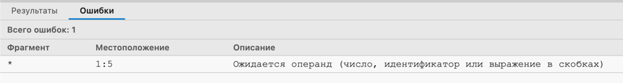
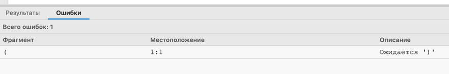
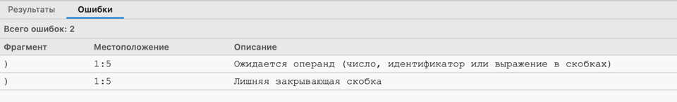
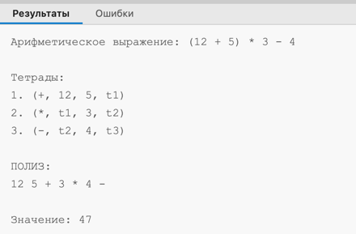

# Лабораторная работа №6. Создание внутренней формы представления программы

## 1. Название работы и автор

Тема работы: построение внутреннего представления арифметических выражений на основе контекстно-свободной грамматики, реализация синтаксического анализатора методом рекурсивного спуска, генерация тетрад и ПОЛИЗ.

Автор: Ненашкин Владимир Денисович, группа АВТ-313.

## 2. Вариант задания

Вариант: 1. Kotlin.

Для лабораторной работы рассматриваются арифметические выражения с идентификаторами, целыми числами, операциями `+`, `-`, `*`, `/`, `%` и круглыми скобками.

Полное определение КС-грамматики:

```text
E  → T A
A  → ε | + T A | - T A
T  → F B
B  → ε | * F B | / F B | % F B
F  → num | id | (E)
id → letter {letter | digit | _}
num → digit {digit}
```

Где:

```text
letter → a | b | ... | z | A | B | ... | Z
digit  → 0 | 1 | ... | 9
```

Примеры верных строк:

```text
a + b * c
(12 + 5) * 3 - 4
value_1 % 10 + counter2
```

## 3. Лексические и синтаксические ошибки

На этапе лексического анализа выделяются следующие классы лексем:

- идентификаторы;
- целые числа;
- операции `+`, `-`, `*`, `/`, `%`;
- скобки `(` и `)`;
- пропуски и переводы строк.

При обнаружении недопустимого символа формируется лексическая ошибка. На этапе синтаксического анализа методом рекурсивного спуска обнаруживаются ошибки вида:

- пропущенный операнд;
- лишняя закрывающая скобка;
- отсутствующая закрывающая скобка;
- неожиданный токен после конца выражения.

При наличии лексических или синтаксических ошибок тетрады и ПОЛИЗ не строятся.

### Диаграмма лексера



### Схема рекурсивного спуска


### Тестовые примеры для ошибок

| Входная строка | Ожидаемый результат |
|---|---|
| `9 @ 4` | Лексическая ошибка: недопустимый символ `@` |
| `7 + * 2` | Синтаксическая ошибка: ожидается операнд |
| `(8 - 3` | Синтаксическая ошибка: ожидается `)` |
| `2 + )` | Синтаксическая ошибка: лишняя закрывающая скобка |







## 4. Внутренняя форма представления программы: тетрады

Для корректных выражений приложение формирует внутреннее представление в виде тетрад формата `(op, arg1, arg2, result)`. Для промежуточных результатов вводятся временные переменные `t1`, `t2`, `t3`, ...

Пример для выражения:

```text
(12 + 5) * 3 - 4
```

Таблица тетрад:

| № | op | arg1 | arg2 | result |
|---|---|---|---|---|
| 1 | `+` | `12` | `5` | `t1` |
| 2 | `*` | `t1` | `3` | `t2` |
| 3 | `-` | `t2` | `4` | `t3` |

Именно в таком порядке отражается вычисление выражения с учётом приоритета операций и скобок.



## 5. ПОЛИЗ

ПОЛИЗ строится для того же выражения в постфиксной форме. В приложении используется отдельная кнопка «Вычислить ПОЛИЗ», которая берёт строку из редактора и обрабатывает её независимо от текущего компилятора функций Kotlin.

Для выражения

```text
(12 + 5) * 3 - 4
```

получаем:

```text
12 5 + 3 * 4 -
```

Так как выражение состоит только из целых чисел, приложение дополнительно вычисляет его значение:

```text
47
```

Если выражение содержит идентификаторы, ПОЛИЗ и тетрады всё равно строятся, но численное вычисление пропускается.