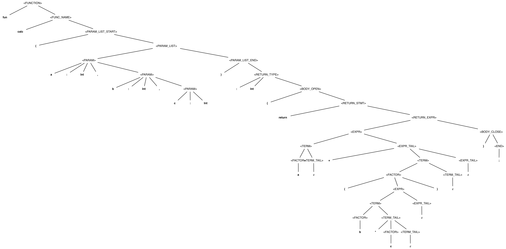

# Лабораторная работа №5. Построение AST и проверка контекстно-зависимых условий

## 1. Название работы и автор

**Тема:** Построение абстрактного синтаксического дерева (AST) и реализация
семантического анализатора для конструкции объявления функции языка Kotlin.

**Автор:** Ненашкин Владимир Денисович, группа АВТ-313, НГТУ, АВТФ.

## 2. Вариант задания

Cоздание функции языка Kotlin.

Анализируемая конструкция:

```kotlin
fun имя_функции(параметры): Тип {
    return выражение
};
```

Допустимые типы параметров и возвращаемого значения: `Int`, `Boolean`,
`Float`, `Double`. В выражении возврата допустимы идентификаторы,
целочисленные и вещественные литералы, операции `+`, `-`, `*`, `/` и
скобочные группы.

### Примеры верных строк

```kotlin
fun calc(a: Int, b: Int, c: Int): Int {
    return a + (b * c)
};
```

```kotlin
fun mix(a: Int, b: Float): Float {
    return a + b
};
```

```kotlin
fun isReady(flag: Boolean): Boolean {
    return flag
};
```

## 3. Контекстно-зависимые условия

Семантический анализатор выполняет четыре группы проверок. Сообщения
формируются с указанием строки, столбца и фрагмента (имя или литерал),
вызвавшего ошибку.

| № | Правило | Пример исходного кода | Ожидаемое сообщение |
|---|---|---|---|
| 1 | **Уникальность имён** — параметры функции должны иметь различные имена в пределах одной области видимости | `fun f(a: Int, a: Int): Int { return a };` | `Идентификатор уже объявлен ранее в списке параметров` (фрагмент: `a`) |
| 2 | **Совместимость типов** — тип возвращаемого выражения должен соответствовать объявленному типу функции (допускается расширение `Int → Float → Double`) | `fun f(a: Float): Int { return a };` | `Несовместимость типов: ожидается Int, получено Float` |
| 3 | **Допустимые значения** — числовые литералы должны входить в допустимый диапазон (`Int`: −2³¹…2³¹−1, `Float`: диапазон IEEE‑754) | `fun f(): Int { return 9999999999999999 };` | `Целочисленный литерал выходит за допустимые пределы типа Int` |
| 4 | **Использование объявленных идентификаторов** — все идентификаторы выражения возврата должны быть объявлены среди параметров | `fun f(a: Int): Int { return a + b };` | `Используется необъявленный идентификатор` (фрагмент: `b`) |

Дополнительная проверка типов в выражении: операнды операций `+`, `-`, `*`,
`/` должны быть числовыми. При попытке использовать в арифметике параметр
типа `Boolean` фиксируется ошибка `Операция '+' не применима к типу Boolean`.

Примеры файлов с семантическими ошибками подготовлены в каталоге
[docs/examples](docs/examples/):

- [semantic_01_duplicate_param.kt](docs/examples/semantic_01_duplicate_param.kt) — повторное объявление параметра;
- [semantic_02_undeclared_ident.kt](docs/examples/semantic_02_undeclared_ident.kt) — необъявленный идентификатор;
- [semantic_03_return_type_mismatch.kt](docs/examples/semantic_03_return_type_mismatch.kt) — несовместимость типов;
- [semantic_04_boolean_in_arith.kt](docs/examples/semantic_04_boolean_in_arith.kt) — `Boolean` в арифметическом выражении;
- [semantic_05_int_overflow.kt](docs/examples/semantic_05_int_overflow.kt) — выход целого литерала за пределы `Int`.

## 4. Структура AST

### 4а. Типы узлов

Дерево строится из обобщённого узла `AstNode`, у которого хранятся: вид
узла (`Kind`), упорядоченный список полей (`Fields`) и позиция в исходном
тексте. Поле может содержать либо скалярный атрибут (`Label: Value`), либо
вложенный узел.

| Узел | Назначение | Атрибуты | Дочерние узлы |
|---|---|---|---|
| `FunctionDeclNode` | объявление функции | `name` | `params: ParamListNode`, `returnType: TypeNode`, `body: ReturnStmtNode` |
| `ParamListNode` | список формальных параметров | — | произвольное число `ParamNode` |
| `ParamNode` | формальный параметр | `name` | `type: TypeNode` |
| `TypeNode` | тип параметра или возвращаемого значения | `name` | — |
| `ReturnStmtNode` | оператор `return` | — | `expr` (выражение) |
| `BinaryOpNode` | бинарная операция `+`, `-`, `*`, `/` | `op` | `left`, `right` |
| `IdentifierNode` | использование идентификатора в выражении | `name` | — |
| `IntLiteralNode` | целочисленный литерал | `value` | — |
| `FloatLiteralNode` | вещественный литерал | `value` | — |

Объявленные параметры регистрируются в таблице символов `SymbolTable`,
которая поддерживает методы `Declare`, `Lookup` и иерархию областей
видимости через ссылку на родительскую таблицу.

### 4б. AST для верной строки



### 4в. Формат вывода AST в программе

AST выводится в текстовом виде, аналогичном утилите `tree`: безымянные
дочерние элементы отображаются как `├──`/`└──`, скалярные атрибуты — в
виде `label: значение`. Для приведённой выше строки результат выглядит
следующим образом:

```
FunctionDeclNode
├── name: "calc"
├── params: ParamListNode
│   ├── ParamNode
│   │   ├── name: "a"
│   │   └── type: TypeNode
│   │       └── name: "Int"
│   ├── ParamNode
│   │   ├── name: "b"
│   │   └── type: TypeNode
│   │       └── name: "Int"
│   └── ParamNode
│       ├── name: "c"
│       └── type: TypeNode
│           └── name: "Int"
├── returnType: TypeNode
│   └── name: "Int"
└── body: ReturnStmtNode
    └── expr: BinaryOpNode
        ├── op: "+"
        ├── left: IdentifierNode
        │   └── name: "a"
        └── right: BinaryOpNode
            ├── op: "*"
            ├── left: IdentifierNode
            │   └── name: "b"
            └── right: IdentifierNode
                └── name: "c"
```

В графическом интерфейсе AST размещается во вкладке «Результаты» вместе
с заголовком об успешном завершении анализа или о количестве найденных
ошибок. Семантические ошибки выводятся во вкладке «Ошибки» в виде таблицы
со столбцами «Фрагмент», «Местоположение» и «Описание»; в строке итогов
указано общее количество ошибок.

## 5. Тестовые примеры

Примеры запуска семантического анализатора (входная строка → ожидаемый
результат). Скриншоты сохранены в каталоге `docs/`.

| № | Входной файл / строка | Результат | Скриншот |
|---|---|---|---|
| 1 | `fun calc(a: Int, b: Int, c: Int): Int { return a + (b * c) };` | Семантический анализ завершён успешно. Выведено AST. | `docs/semantic_valid.png` |
| 2 | [semantic_01_duplicate_param.kt](docs/examples/semantic_01_duplicate_param.kt) | Ошибка: идентификатор `a` уже объявлен ранее в списке параметров. | `docs/semantic_duplicate.png` |
| 3 | [semantic_02_undeclared_ident.kt](docs/examples/semantic_02_undeclared_ident.kt) | Ошибка: используется необъявленный идентификатор `b`. | `docs/semantic_undeclared.png` |
| 4 | [semantic_03_return_type_mismatch.kt](docs/examples/semantic_03_return_type_mismatch.kt) | Ошибка: несовместимость типов — ожидается `Int`, получено `Float`. | `docs/semantic_type_mismatch.png` |
| 5 | [semantic_04_boolean_in_arith.kt](docs/examples/semantic_04_boolean_in_arith.kt) | Ошибка: операция `+` не применима к типу `Boolean`. | `docs/semantic_boolean.png` |
| 6 | [semantic_05_int_overflow.kt](docs/examples/semantic_05_int_overflow.kt) | Ошибка: целочисленный литерал выходит за допустимые пределы типа `Int`. | `docs/semantic_overflow.png` |

В случае лексических или синтаксических ошибок семантический анализ не
запускается: пользователю показывается соответствующее сообщение, а
таблица ошибок заполняется ошибками предыдущих этапов.

Корректность поведения подтверждается автоматическими тестами в файле
[semantic_test.go](semantic_test.go) (запуск `go test ./...`).

## 6. Инструкция по запуску

### Требования

- Go ≥ 1.21;
- Node.js ≥ 18 и npm;
- Wails CLI v2 (`go install github.com/wailsapp/wails/v2/cmd/wails@latest`);
- ANTLR 4 — только при необходимости перегенерации лексера/парсера ANTLR
  (`tools/generate_antlr.sh`).

### Сборка и запуск приложения

```sh
# установка JS-зависимостей
cd frontend && npm install && cd ..

# режим разработки (горячая перезагрузка)
wails dev

# сборка релизной версии
wails build
# готовый бинарь будет в build/bin/
```

Главное окно содержит редактор кода, панель результатов с вкладками
«Результаты» и «Ошибки» и пункт меню **Пуск → Семантический анализ**
(а также кнопку Σ на панели инструментов и комбинацию `Ctrl+Alt+R`).

### Запуск тестов

```sh
go test ./...
```

Тесты проверяют как ранее реализованные лексер и парсер, так и
семантический анализатор: уникальность параметров, недопустимые
идентификаторы, несовместимость типов, диапазоны числовых литералов,
численное расширение `Int → Float`, отсутствие AST при ошибках парсера.