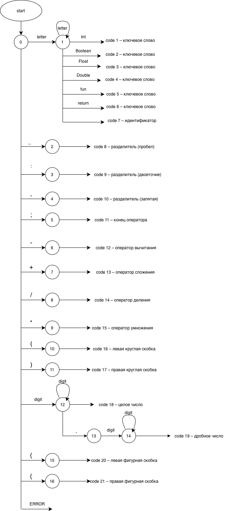

# Лабораторная работа №2

## Разработка лексического анализатора для языкового процессора

**Студент:** Ненашкин Владимир Денисович  
**Группа:** АВТ-313  
**Университет:** НГТУ, АВТФ  
**Вариант:** 74  
**Формулировка варианта:** Создание функции языка Kotlin

---

## Цель работы

Изучить назначение и принципы работы лексического анализатора в структуре компилятора. Спроектировать алгоритм в виде диаграммы состояний и выполнить программную реализацию сканера для выделения лексем из входного текста. Интегрировать разработанный модуль в ранее созданный графический интерфейс языкового процессора.

## Постановка задачи

Разработать лексический анализатор в соответствии с индивидуальным вариантом задания, интегрировать его в приложение из лабораторной работы №1 и обеспечить наглядный вывод результатов. Анализатор должен принимать строку исходного текста, выделять все допустимые лексемы, классифицировать их по типам, определять позицию каждой лексемы, обнаруживать недопустимые символы и корректно обрабатывать многострочный ввод.

---

## Вариант задания

Вариант 74 посвящён распознаванию функции языка Kotlin в рамках ограниченного подмножества лексем. Реализованный лексер ориентирован на конструкцию вида:

```kotlin
fun calc(a: Int, b: Int, c: Int): Int {
    return a + (b * c)
};
```

Поддерживается только тот набор лексем, который задан спроектированным конечным автоматом. Лексер не пытается анализировать весь язык Kotlin целиком.

### Примеры корректных входных строк

```kotlin
fun calc(a: Int, b: Int, c: Int): Int {
    return a + (b * c)
};
```

```kotlin
return value
```

```kotlin
123 45.67
```

### Перечень допустимых лексем

| Код | Тип лексемы | Представление |
|---|---|---|
| 1 | ключевое слово | `Int` |
| 2 | ключевое слово | `Boolean` |
| 3 | ключевое слово | `Float` |
| 4 | ключевое слово | `Double` |
| 5 | ключевое слово | `fun` |
| 6 | ключевое слово | `return` |
| 7 | идентификатор | последовательность букв латинского алфавита |
| 8 | разделитель | один или несколько пробельных символов |
| 9 | разделитель | `:` |
| 10 | разделитель | `,` |
| 11 | разделитель | `;` |
| 12 | оператор | `-` |
| 13 | оператор | `+` |
| 14 | оператор | `/` |
| 15 | оператор | `*` |
| 16 | скобка | `(` |
| 17 | скобка | `)` |
| 18 | число | целое число |
| 19 | число | дробное число |
| 20 | разделитель | `{` |
| 21 | разделитель | `}` |

Все остальные символы считаются недопустимыми и должны приводить к формированию сообщения об ошибке с указанием строки и позиции.

---

## Диаграмма состояний



### Краткое описание работы автомата

- Начальное состояние `0` определяет, к какому классу относится текущий символ.
- Состояние `1` считывает последовательность букв и затем классифицирует её как ключевое слово или идентификатор.
- Состояние `2` объединяет подряд идущие пробельные символы в одну лексему.
- Состояния `12`, `13` и `14` используются для распознавания целых и дробных чисел.
- Операторы и разделители из одного символа распознаются сразу при выходе из начального состояния.
- Если символ не соответствует ни одному допустимому переходу, формируется лексическая ошибка.

---

## Тестовые примеры

### Корректная строка

| Входная строка | Выходная последовательность |
|---|---|
| `fun calc(a: Int, b: Int, c: Int): Int { return a + (b * c) };` | `5(fun), 8( ), 7(calc), 16((), 7(a), 9(:), 8( ), 1(Int), 10(,), 8( ), 7(b), 9(:), 8( ), 1(Int), 10(,), 8( ), 7(c), 9(:), 8( ), 1(Int), 17()), 9(:), 8( ), 1(Int), 8( ), 20({), 8( ), 6(return), 8( ), 7(a), 8( ), 13(+), 8( ), 16((), 7(b), 8( ), 15(*), 8( ), 7(c), 17()), 8( ), 21(}), 11(;)` |

### Строка с недопустимым символом

| Входная строка | Выход |
|---|---|
| `fun calc@a` | Токены до ошибки: `5(fun), 8( ), 7(calc)`; ошибка: символ `@`, строка `1`, столбец `9` |

### Многострочный пример

| Входной текст | Выходная последовательность |
|---|---|
| `fun calc(a: Int): Int {`<br/>`    return a`<br/>`};` | `5(fun), 8( ), 7(calc), 16((), 7(a), 9(:), 8( ), 1(Int), 17()), 9(:), 8( ), 1(Int), 8( ), 20({), 8(\n    ), 6(return), 8( ), 7(a), 8(\n), 21(}), 11(;)` |