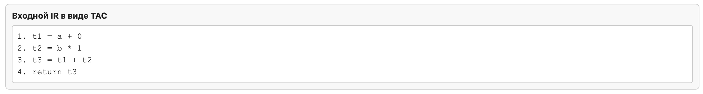
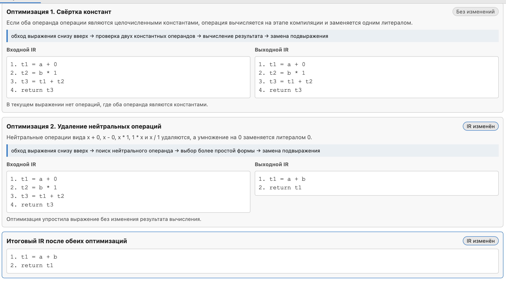
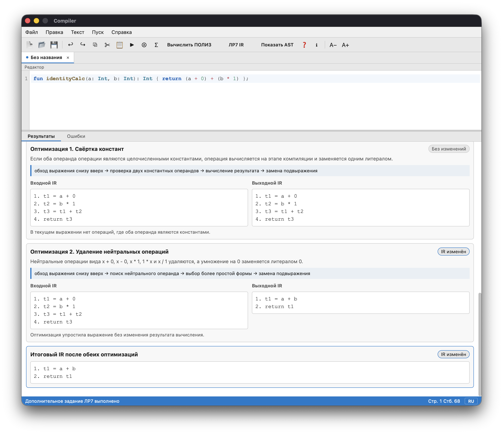

# Дополнительное задание к лабораторной работе 7

## Анализ и оптимизация конструкции объявления функции

Студент: Ненашкин Владимир Денисович  
Группа: АВТ-313  
Вариант: функции, объявление / создание

## Цель работы

Реализовать в GUI-программе построение AST, генерацию промежуточного представления и локальные оптимизации для выбранной синтаксической конструкции языка Kotlin.

Рассматриваемая конструкция:

```kotlin
fun calc(a: Int, b: Int, c: Int): Int { return a + b * c };
```

## Постановка задачи

Для выбранной конструкции необходимо:

1. Построить абстрактное синтаксическое дерево.
2. Сгенерировать промежуточное представление в виде трехадресного кода.
3. Реализовать две локальные оптимизации.
4. Показать входной и выходной IR после каждой оптимизации.
5. Встроить все пункты в GUI программы.

## Что добавлено в программу

В приложение добавлена команда `ЛР7 IR`. Она доступна в меню `Пуск`, на панели инструментов и по горячей клавише `Ctrl+Alt+O`.

Команда выполняет следующие действия:

1. Берет текст текущей функции из редактора.
2. Запускает лексический и синтаксический анализ.
3. Выполняет семантическую проверку.
4. Строит AST функции.
5. Генерирует TAC для выражения в `return`.
6. Применяет локальные оптимизации.
7. Показывает результат в нижней панели GUI отдельными секциями.

Основные файлы реализации:

- `lab7_optimizer.go` — построение AST/TAC и локальные оптимизации.
- `lab7_optimizer_test.go` — тесты для дополнительного задания.
- `frontend/src/components/OutputTabs.tsx` — отдельное отображение результата ЛР7.
- `frontend/src/components/OutputTabs.css` — стили секций результата.
- `frontend/src/hooks/useFileActions.ts` — вызов backend-метода из GUI.
- `frontend/src/commands.ts` — регистрация команды `ЛР7 IR`.

## AST конструкции

Для функции `calc` строится AST следующего вида:


## IR в виде трехадресного кода

Для выражения `a + b * c` формируется TAC:

```text
1. t1 = b * c
2. t2 = a + t1
3. return t2
```

Такой IR явно показывает порядок вычислений: сначала выполняется умножение, затем сложение.


## Оптимизация 1. Свёртка констант

Свёртка констант применяется, если оба операнда арифметической операции являются целочисленными литералами. В этом случае операция вычисляется на этапе компиляции, а подвыражение заменяется одним значением.

Оптимизация является локальной, потому что работает только внутри выражения текущей функции и не использует данные из других частей программы.

Обобщённая блок-схема:

```text
начало
  |
обход выражения снизу вверх
  |
оба операнда являются константами?
  | да
вычислить значение операции
  |
заменить подвыражение литералом
  |
  | нет
оставить подвыражение без изменения
  |
конец
```

Пример входной функции для проверки:

```kotlin
fun constCalc(): Int { return 2 + 3 * 4 };
```

Входной IR:


Выходной IR:


Для основной функции `calc(a, b, c)` эта оптимизация не изменяет IR, потому что выражение содержит параметры, а не только константы.

## Оптимизация 2. Удаление нейтральных операций

Удаление нейтральных операций применяется к выражениям, которые можно упростить без изменения результата вычисления.

Используются правила:

```text
x + 0 -> x
0 + x -> x
x - 0 -> x
x * 1 -> x
1 * x -> x
x / 1 -> x
x * 0 -> 0
0 * x -> 0
```

Оптимизация также является локальной: она анализирует только дерево выражения внутри текущего `return`.

Обобщённая блок-схема:

```text
начало
  |
обход выражения снизу вверх
  |
найдена нейтральная операция?
  | да
заменить выражение более простой формой
  |
  | нет
оставить выражение без изменения
  |
конец
```

Пример входной функции для проверки:

```kotlin
fun identityCalc(a: Int, b: Int): Int { return (a + 0) + (b * 1) };
```

Входной IR:



Выходной IR:



Для основной функции `calc(a, b, c)` эта оптимизация не изменяет IR, потому что в выражении нет операций с `0` или `1`.


## Отображение в GUI

Результат команды `ЛР7 IR` выводится не сплошным текстом, а отдельными секциями:

- исходная конструкция;
- AST;
- входной TAC;
- результат свёртки констант;
- результат удаления нейтральных операций;
- итоговый IR после последовательного применения оптимизаций.

Для каждой оптимизации GUI показывает входной IR, выходной IR и статус: `IR изменён` или `Без изменений`.



## Проверка

Backend-тесты запускаются командой:

```bash
go test ./...
```

Сборка frontend проверяется командой:

```bash
cd frontend
npm run build
```

## Вывод

В ходе выполнения дополнительного задания для лабораторной работы 7 в GUI-программу был добавлен отдельный режим анализа функции. Для конструкции объявления функции строится AST, затем для выражения в операторе `return` формируется промежуточное представление TAC.

Реализованы две локальные оптимизации: свёртка констант и удаление нейтральных операций. Обе оптимизации сохраняют семантику исходного выражения и работают только внутри одной функции. Результаты отображаются в GUI в структурированном виде, что позволяет отдельно увидеть исходный IR, результат каждой оптимизации и итоговый IR.
