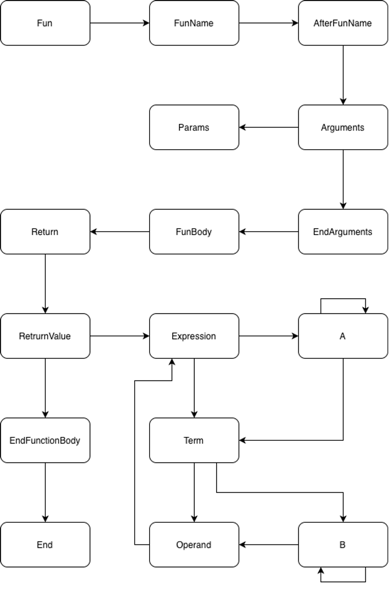
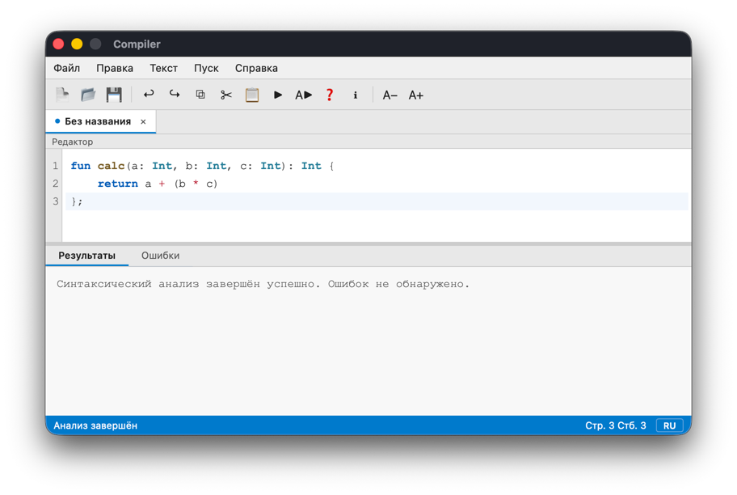
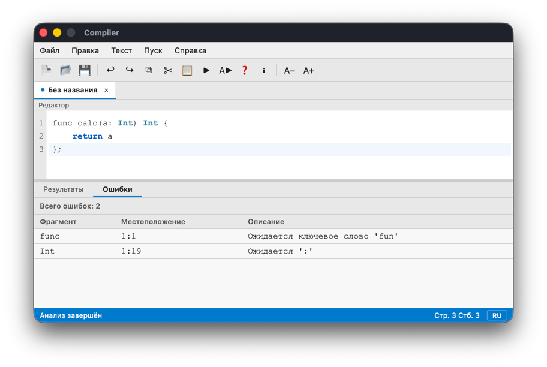
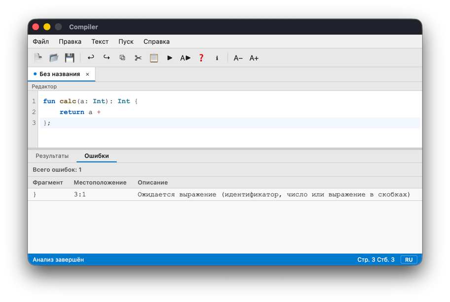
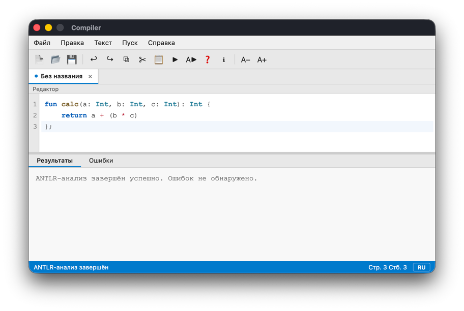
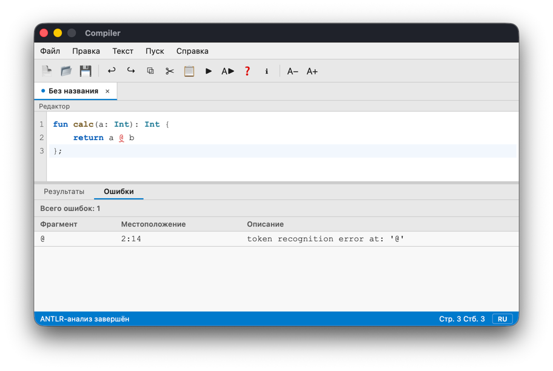

# Лабораторная работа №3. Разработка синтаксического анализатора для языкового процессора

## 1. Название и цель лабораторной работы

Цель работы заключается в изучении назначения и принципов работы синтаксического анализатора в составе компилятора, разработке формальной грамматики для заданной конструкции языка Kotlin, реализации синтаксического анализа методом рекурсивного спуска, генерации альтернативного лексера и парсера с помощью ANTLR, а также интеграции обеих реализаций в графический интерфейс языкового процессора.

## 2. Сведения об авторе

- Ненашкин Владимир Денисович
- группа АВТ-313
- НГТУ, АВТФ

## 3. Постановка задачи

Необходимо разработать синтаксический анализатор для конструкции создания функции языка Kotlin в соответствии с индивидуальным вариантом задания. Парсер должен принимать текст программы из редактора, выполнять проверку на соответствие разработанной грамматике, выводить сообщение об успешном анализе при отсутствии ошибок и формировать таблицу синтаксических ошибок при наличии нарушений. Также требуется реализовать нейтрализацию синтаксических ошибок методом Айронса. Дополнительно необходимо сгенерировать лексер и парсер для той же грамматики с помощью ANTLR, встроить их в приложение и протестировать в отдельном режиме запуска.

## 4. Вариант задания

**Вариант 74:** создание функции языка Kotlin.

Анализируемая конструкция имеет вид:

```kotlin
fun имя_функции(параметры): Тип {
    return выражение
};
```

### Примеры корректных входных строк

```kotlin
fun calc(a: Int, b: Int, c: Int): Int {
    return a + (b * c)
};
```

```kotlin
fun mult(x: Int, y: Int): Int {
    return x * y
};
```

```kotlin
fun average(sum: Float, count: Float): Float {
    return sum / count
};
```

### Перечень допустимых лексем

| Код | Лексема | Назначение |
|---|---|---|
| 1 | `Int` | тип данных |
| 2 | `Boolean` | тип данных |
| 3 | `Float` | тип данных |
| 4 | `Double` | тип данных |
| 5 | `fun` | ключевое слово объявления функции |
| 6 | `return` | ключевое слово возврата |
| 7 | идентификатор | имя функции, параметра или операнда |
| 8 | пробельная последовательность | разделитель между лексемами |
| 9 | `:` | разделитель имени и типа |
| 10 | `,` | разделитель параметров |
| 11 | `;` | конец конструкции |
| 12 | `-` | оператор вычитания |
| 13 | `+` | оператор сложения |
| 14 | `/` | оператор деления |
| 15 | `*` | оператор умножения |
| 16 | `(` | левая круглая скобка |
| 17 | `)` | правая круглая скобка |
| 18 | целое число | числовой литерал |
| 19 | вещественное число | числовой литерал |
| 20 | `{` | начало тела функции |
| 21 | `}` | конец тела функции |

Все остальные символы считаются недопустимыми и приводят к формированию лексической ошибки.

## 5. Разработка грамматики

В проекте используются две записи одной и той же грамматики: грамматика, переписанная в формате ANTLR.

### 5.1. Разработанная грамматика
```
G[<F>]:
1)  <FUNCTION> -> fun <FUNC_NAME>
2)  <FUNC_NAME> -> id <PARAM_LIST_START>
3)  <PARAM_LIST_START> -> ( <PARAM_LIST>
4)  <PARAM_LIST> -> <PARAM> <PARAM_LIST_END>
5)  <PARAM> -> id : type | id : type , <PARAM>
6)  <PARAM_LIST_END>  -> ) <RETURN_TYPE>
7)  <RETURN_TYPE> -> : type <BODY_OPEN>
8)  <BODY_OPEN> -> { <RETURN_STMT>
9)  <RETURN_STMT> -> return <RETURN_EXPR>
10) <RETURN_EXPR> -> <EXPR> <BODY_CLOSE>
11) <BODY_CLOSE> -> } <END>
12) <EXPR> -> <TERM> <EXPR_TAIL>
13) <EXPR_TAIL> -> + <TERM> <EXPR_TAIL> | - <TERM> <EXPR_TAIL> | ε
14) <TERM> -> <FACTOR> <TERM_TAIL>
15) <TERM_TAIL> -> * <FACTOR> <TERM_TAIL> | / <FACTOR> <TERM_TAIL> | ε
16) <FACTOR> -> id | num | ( <EXPR> )
17) <END> -> ;
18) <IDENTIFIER> -> letter <IDENTIFIER_TAIL>
19) <IDENTIFIER_TAIL> -> letter <IDENTIFIER_TAIL> | digit <IDENTIFIER_TAIL> | ε
20) <NUMBER> -> digit <NUMBER_TAIL>
21) <NUMBER_TAIL> -> digit <NUMBER_TAIL> | ε

‒ num = <NUMBER>
‒ id = <IDENTIFIER>
‒ letter -> 'a' | 'b' | ... | 'z' | 'A' | 'B' | ... | 'Z'
‒ digit -> '0' | '1' | ... | '9'
‒ type -> ' Int | ' Double | ' Boolean' | ' Float`
Следуя введенному формальному определению грамматики, представим G[<F>] ее составляющими:
‒ Z = <F>
‒ VT = {a, b, ..., z, A, B, ..., Z, 0, 1, ...,9, +, -, /, *, {, }, (, ), ;, _}
‒ VN = {<FUNCTION>, <FUNC_NAME>, <PARAM_LIST_START>, <PARAM_LIST>, <PARAM>, <PARAM_LIST_END>, <RETURN_TYPE>, <BODY_OPEN>, <RETURN_STMT>, <RETURN_EXPR>, <BODY_CLOSE>, <EXPR>, <EXPR_TAIL>, <TERM>, <TERM_TAIL>, <FACTOR>, <END>, <IDENTIFIER>, <IDENTIFIER_TAIL>, <NUMBER>, <NUMBER_TAIL>}
```

### 5.2. Грамматика, переписанная для ANTLR

```antlr
grammar KotlinFunction;

program
    : funDecl SEMI EOF
    ;

funDecl
    : FUN IDENTIFIER LPAREN paramList? RPAREN COLON typeRef LBRACE body RBRACE
    ;

paramList
    : param (COMMA param)*
    ;

param
    : IDENTIFIER COLON typeRef
    ;

typeRef
    : INT_TYPE
    | BOOLEAN_TYPE
    | FLOAT_TYPE
    | DOUBLE_TYPE
    ;

body
    : returnStmt
    ;

returnStmt
    : RETURN expr
    ;

expr
    : term ((PLUS | MINUS) term)*
    ;

term
    : factor ((STAR | SLASH) factor)*
    ;

factor
    : IDENTIFIER
    | FLOAT_LITERAL
    | INTEGER_LITERAL
    | LPAREN expr RPAREN
    ;

FUN: 'fun';
RETURN: 'return';
INT_TYPE: 'Int';
BOOLEAN_TYPE: 'Boolean';
FLOAT_TYPE: 'Float';
DOUBLE_TYPE: 'Double';
COLON: ':';
COMMA: ',';
SEMI: ';';
PLUS: '+';
MINUS: '-';
STAR: '*';
SLASH: '/';
LPAREN: '(';
RPAREN: ')';
LBRACE: '{';
RBRACE: '}';
FLOAT_LITERAL: [0-9]+ '.' [0-9]+;
INTEGER_LITERAL: [0-9]+;
IDENTIFIER: [a-zA-Z_] [a-zA-Z0-9_]*;
WS: [ \t\r\n]+ -> skip;
```

## 6. Классификация грамматики

Разработанная грамматика относится к контекстно-свободным грамматикам, то есть к грамматикам типа 2 по классификации Хомского. Это объясняется тем, что в каждой продукции слева расположен ровно один нетерминальный символ, а справа находится цепочка терминалов и нетерминалов.

Общий вид продукций имеет форму:

```text
A -> α, где A ∈ VN, α ∈ (VN ∪ VT)*
```

Грамматика не является регулярной, поскольку содержит рекурсивное описание выражений и вложенные скобочные конструкции:

```text
<Factor> -> ( <Expr> )
```

## 7. Метод анализа



## 8. Диагностика и нейтрализация синтаксических ошибок

При обнаружении синтаксической ошибки анализатор формирует запись, содержащую ошибочный фрагмент, номер строки, позицию символа и описание ошибки. В парсере нейтрализация реализована методом Айронса: после обнаружения ошибки строится множество синхронизации из ожидаемого символа и допустимых последующих символов, затем входной поток пропускается до достижения точки восстановления, после чего разбор продолжается.

Такой подход позволяет:

- не завершать анализ после первой ошибки;
- выявлять несколько ошибок за один запуск;
- уменьшать количество производных сообщений после одной первичной ошибки.

Если на этапе лексического анализа обнаружены недопустимые символы, синтаксический анализ не запускается, а в интерфейсе отображаются только лексические ошибки. Для режима ANTLR используется аналогичный принцип: сначала работает сгенерированный лексер, и только при отсутствии лексических ошибок запускается сгенерированный парсер.

## 9. Тестовые примеры

### 9.1. Корректная строка

```kotlin
fun calc(a: Int, b: Int, c: Int): Int {
    return a + (b * c)
};
```

Ожидаемый результат: сообщение об успешном завершении синтаксического анализа, таблица ошибок пуста.



### 9.2. Синтаксическая ошибка в заголовке функции

```kotlin
func calc(a: Int) Int {
    return a
};
```

Ожидаемый результат: вывод синтаксических ошибок для неверного ключевого слова и отсутствующего двоеточия перед типом возвращаемого значения.



### 9.3. Ошибка в выражении

```kotlin
fun calc(a: Int): Int {
    return a +
};
```

Ожидаемый результат: сообщение об ошибке разбора выражения после оператора `+`, при этом анализатор должен восстановиться и корректно завершить анализ строки.



### 9.4. Корректная строка для режима ANTLR

```kotlin
fun calc(a: Int, b: Int, c: Int): Int {
    return a + (b * c)
};
```

Ожидаемый результат: сообщение об успешном завершении ANTLR-анализа, таблица ошибок пуста.



### 9.5. Лексическая ошибка для режима ANTLR

```kotlin
fun calc(a: Int): Int {
    return a @ b
};
```

Ожидаемый результат: вывод только лексической ошибки по символу `@`, без запуска синтаксического анализа ANTLR.

