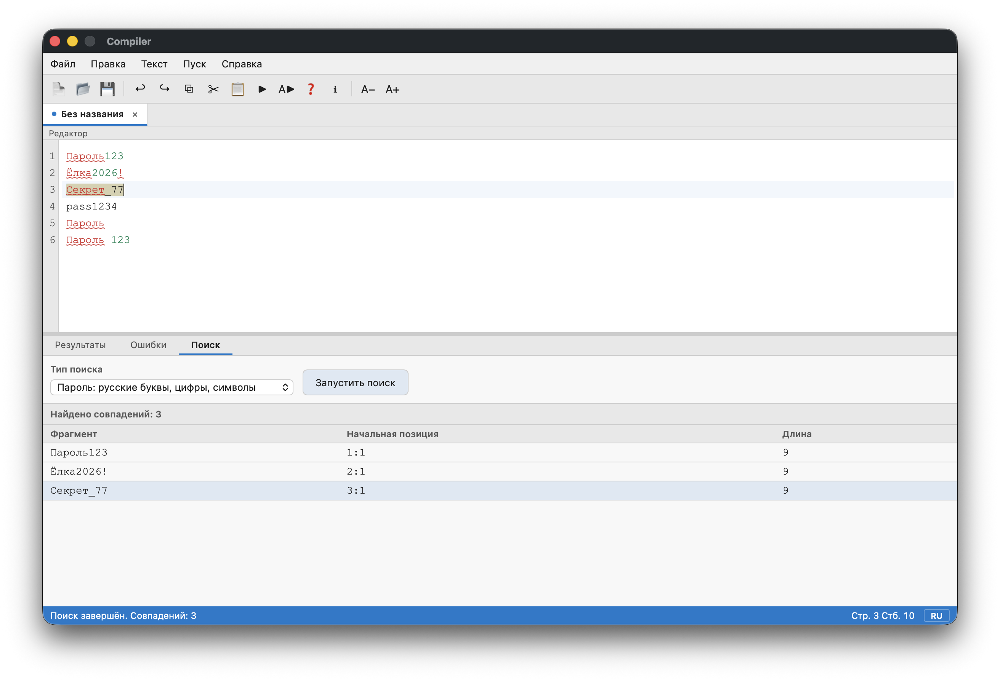
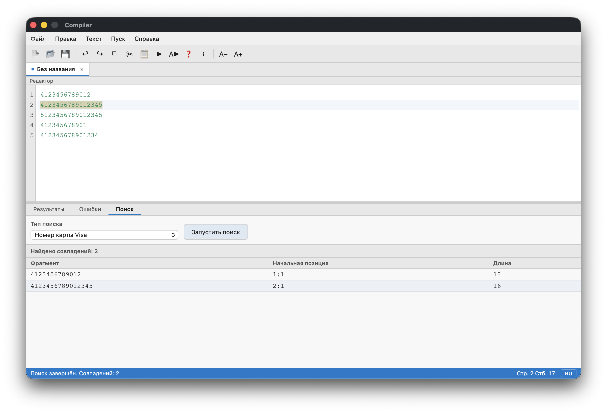
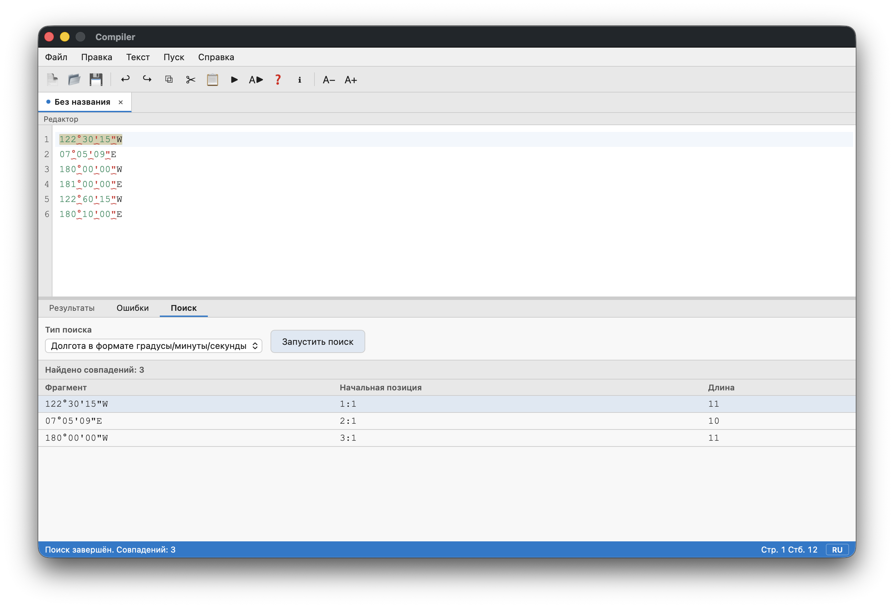

# Лабораторная работа №4. Реализация алгоритма поиска подстрок с помощью регулярных выражений

## 1. Название и цель лабораторной работы

**Название лабораторной работы:** реализация алгоритма поиска подстрок с помощью регулярных выражений.

**Цель лабораторной работы:** изучить теоретические основы регулярных выражений и их применение для поиска и извлечения подстрок из текста, освоить практические навыки использования библиотечных средств работы с регулярными выражениями, а также интеграцию алгоритмов поиска в графический интерфейс приложения.

## 2. Сведения об авторе

- Ненашкин Владимир Денисович
- группа АВТ-313
- НГТУ, АВТФ

## 3. Постановка задачи

Необходимо разработать модуль поиска подстрок с использованием регулярных выражений и интегрировать его в существующее приложение-текстовый редактор. Программа должна обеспечивать выбор типа поиска, запуск анализа, вывод результатов в таблицу и подсветку найденных фрагментов в исходном тексте. Проверка выполняется построчно: совпадением считается строка, которая целиком соответствует выбранному регулярному выражению.

Вариант задания включает 3 задачи:

1. Пароль, состоящий из русских букв, цифр и специальных символов, длиной не менее 8 символов.
2. Номер карты Visa.
3. Долгота в формате градусы/минуты/секунды.

## 4. Решение 3 задач (регулярные выражения)

### 4.1. Задача 1. Пароль

**a) Описание задачи**

Найти строки, которые можно интерпретировать как пароль: допустимы русские буквы, цифры и специальные символы `!@#$%^&*()_-=+`, минимальная длина 8 символов.

**b) Регулярное выражение с пояснением каждого обозначения**

```regex
^[А-Яа-яЁё0-9!@#$%^&*()_\-=+]{8,}$
```

**Пояснение обозначений:**

| Часть | Что делает |
|---|---|
| `^` | Начало строки |
| `[А-Яа-яЁё0-9!@#$%^&*()_\-=+]` | Класс допустимых символов: русские буквы, цифры и специальные символы |
| `А-Я` | Прописные русские буквы |
| `а-я` | Строчные русские буквы |
| `Ёё` | Буквы Ё и ё, добавленные отдельно |
| `0-9` | Цифры |
| `!@#$%^&*()_\-=+` | Допустимые специальные символы |
| `{8,}` | Минимальная длина совпадения 8 символов |
| `$` | Конец строки |

**c) Примеры строк, которые должны находиться**

- Пароль123
- Ёлка2026!
- Секрет_77

**d) Примеры строк, которые не должны находиться**

- pass1234
- Пароль
- Пароль 123

**e) Тестовые примеры (скриншоты)**



### 4.2. Задача 2. Номер карты Visa

**a) Описание задачи**

Найти строки с номерами карт Visa. Номер должен начинаться с цифры `4` и содержать 13 или 16 цифр.

**b) Регулярное выражение с пояснением каждого обозначения**

```regex
^4[0-9]{12}([0-9]{3})?$
```

**Пояснение обозначений:**

| Часть | Что делает |
|---|---|
| `^` | Начало строки |
| `4` | Первая цифра номера карты Visa |
| `[0-9]{12}` | Ещё 12 цифр после первой четвёрки |
| `([0-9]{3})?` | Необязательная группа ещё из 3 цифр |
| `?` | Группа может присутствовать один раз или отсутствовать |
| `$` | Конец строки |

**c) Примеры строк, которые должны находиться**

- 4123456789012
- 4123456789012345

**d) Примеры строк, которые не должны находиться**

- 5123456789012345
- 412345678901
- 412345678901234

**e) Тестовые примеры (скриншоты)**



### 4.3. Задача 3. Долгота в формате градусы/минуты/секунды

**a) Описание задачи**

Найти строки с долготой в формате `градусы°минуты'секунды"E/W`. Допустимый диапазон градусов: от 0 до 180, минут и секунд: от 00 до 59. Для значения 180 градусов минуты и секунды должны быть равны `00`.

**b) Регулярное выражение с пояснением каждого обозначения**

```regex
^(([0-9]{1,2}|1[0-7][0-9])°[0-5][0-9]'[0-5][0-9]"[EW]|180°00'00"[EW])$
```

**Пояснение обозначений:**

| Часть | Что делает |
|---|---|
| `^` | Начало строки |
| `(` ... `|` ... `)` | Две альтернативы: первая для 0–179 градусов, вторая для 180 градусов |
| `[0-9]{1,2}` | Значения градусов от 0 до 99 |
| `|` | Оператор «или» |
| `1[0-7][0-9]` | Значения градусов от 100 до 179 |
| `°` | Символ градусов |
| `[0-5][0-9]` | Минуты или секунды от 00 до 59 |
| `'` | Символ минут |
| `"` | Символ секунд |
| `[EW]` | Направление: восток или запад |
| `180°00'00"[EW]` | Специальный случай для 180 градусов |
| `$` | Конец строки |

**c) Примеры строк, которые должны находиться**

- 122°30'15"W
- 07°05'09"E
- 180°00'00"W

**d) Примеры строк, которые не должны находиться**

- 181°00'00"E
- 122°60'15"W
- 180°10'00"E

**e) Тестовые примеры (скриншоты)**

